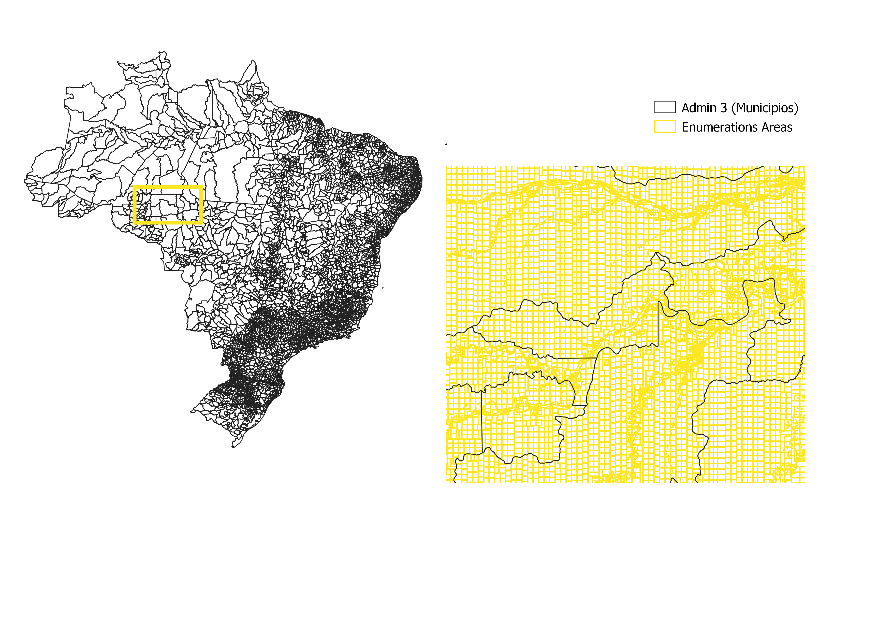
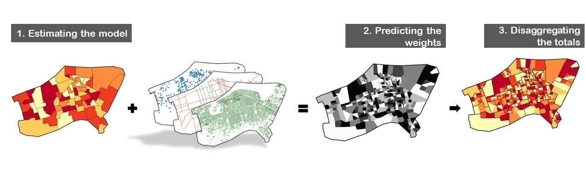

```{r, echo=F}
knitr::opts_chunk$set(message = FALSE, echo = T, warning = FALSE, eval = FALSE)

```

# Introduction

This tutorial aims at explaining the methods behind [WorldPop top-down census disaggregation](https://www.worldpop.org/methods/top_down_constrained_vs_unconstrained) .

The purpose of **top-down disaggregation is to estimate population counts at a lower spatial resolution** than the available census totals to answer the increasing demand for accurate and up-to-date sub-administrative population distribution.

To do so, statistical models leverage the availability at a finer scale of ancillary geospatial covariates. The relationship between population totals and geospatial covariates is estimated at the coarse population input level. It is then projected at a fine level using the spatial precision of the covariates.

WorldPop developed a machine learning model based on random forests to project population count at grid cell level [@stevens2015; @sorichetta2015].

**The tutorial** will adapt this method for **disaggregating admininistrative population totals** **into census enumeration areas**. We will use Brazilian Stats Office census data, *municipios* projections for the administrative unit level 3 population count and xxx as enumeration areas. Figure \@ref(fig:boundaries) compares the two spatial scales.

```{r boundaries, echo=F, eval=T, warning=T, fig.cap='Example of enumeration area boundaries in Brazil', out.width = "70%", fig.align="center"}



```

# Methods Overview

## Modelling process

The modelling process consists of three steps:

1.  Estimate the relationship between population density and geospatial covariates at admin 3 level
2.  Predict density at enumeration area level using the covariates
3.  Use the densities as a weighting layer to disaggregate the admin 3 population count.

The core product is the weighting layer that should reflect the spatial distribution of the population inside the admin 3.

**NB**: The modelling uses as response variable the log population density. First, focusing on population density builds a continuous variable from the population count, which is easier to model. It also ensures better comparability between admin 3 observations of varying sizes. Second, the logarithm transformation reshapes the response variable as a Gaussian distribution, better inline with covariates distribution [@stevens2015].

```{r schema, echo=F, eval=T, warning=T, fig.cap='Modelling Process', out.width = "100%", fig.align="center"}


```

## Random Forest

The final goal of the statistical model is to **predict the population density correctly** . In the realm of machine learning, random forest model, an ensemble, non-linear, non-parametric modeling approach growing a *forest* of individual regression trees [@breiman2001], has shown great predictive performance [@robnik-ikonja2004] for easy tuning process [@stevens2015].

Another interesting feature of random forest model is **its robustness to multi-scaled covariates and to multi-collinearity**. To ensure that low signals are picked by the algorithm, we shall integrate any covariates that are only slightly related to population or meek variations of an another covariate.

However, adding additional covariates might impact the running time, especially at the prediction stage. This can be overcome by a preliminary step before predicting that discards covariates based on their importance during the fitting stage [@stevens2015; @bondarenko2018].

Finally, as just mentioned, random forest allows to compute metrics on the covariates importance. Multi-collinearity pattern might affect the magnitude of the covariates effect but not their ranking [@genuer2010].

To dive deeper on the subject of random forest, here some online material:

-   A use-R 2009 conference [presentation](https://www.r-project.org/conferences/useR-2009/slides/Cutler.pdf) given by Cutler, Breiman's collaborator that helped on the development of random forest model

-   A 2019 [blog post](https://towardsdatascience.com/understanding-random-forest-58381e0602d2) by Tony Yiu with clear explanations of Random Forest main features namely *bagging* and *covariates randomness* that supports the creation of uncorrelated forest of decision trees.

-   A 2001 [article](https://www.stat.berkeley.edu/~breiman/randomforest2001.pdf) from Breiman explaining the underlying maths.

The implementation we will provide in this tutorial will follow the guidance set up by Bondarenko and al [-@bondarenko2018].

# Environment setup

## R Packages

For running the model we will need mainly the `randomForest` package [@cutler2018] that implements the random forest algorithm in R.

```{r, eval=T}
library(randomForest) # estimating randomo forest model
```

Some administrative packages will also be used:

```{r, eval=T}
library(tictoc) # compute running time
library(doParallel) # processing in parallel
```

And we add additional packages for data manipulation:

```{r, eval=T}

library(tidyverse) # manipulating dataframes
library(data.table) # fast dataframe writing
library(sf) # manipulating vector GIS file
```

## Loading data

We set up directory paths that are based on a main directory called `top-down-tutorial` with two subfolders, `in` , where the input data are stored and `out`, where the output datasets will be stored.

```{r, eval=T}
drive_path <- "//worldpop.files.soton.ac.uk/worldpop/Projects/WP517763_GRID3/Working/git/top-down-tutorial/" # to be adapted
data_path <- paste0(drive_path, "in/")
output_path <- paste0(drive_path, "out/")
```

We load `master_train`, a dataframe that contains population projection and covariates summarized at admin 3 level.

```{r, eval=T}
# Previously built datasets
master_train <- fread(paste0(output_path, "master_train.csv"), data.table = F)
head(master_train[,10:14])

```

We load `master_predict`, a dataframe that contains the covariates summarized at enumeration areas level.

```{r, eval=T}
# Previously built datasets
master_predict <- fread(paste0(output_path, "master_predict.csv"), data.table = F)
head(master_predict[,1:4])
```

# Implementation

## Preparing the input data

We prepare the response variable `y_data`, which is the log-transformation of the population count divided by the admin 3 area.

```{r, eval=T}
y_data <- master_train$pop/master_train$area
y_data <- log(y_data)

```

We build the predictors set `x_data`, by subsetting the covariates from `master_predict`.

To identify which column is a covariate we use the terminology of the `exactextractr` R package that appends the word `mean` to the name of the covariates summarized at the previous processing step.

```{r}
# defining covariates name
names <- colnames(master_train)
cov_names <- names[grepl('mean', names)] # here we select all preprocessed covariates as predictors

#subsetting covariates
x_data <- master_train %>% 
  select(all_of(cov_names))
```

## Fitting the model

We first set up the model.

A critical parameter in random forest model is **mtry** , the number of randomly selected variables for evaluating the best split. This process is at the root of the randomness in *random* forest model. To find the optimal `mtry` value we use the function `tuneRF()` that compares different models based on their out-of-bag error estimate.

The out-of-bag procedure consists of fitting each tree on a sample of the dataset and evaluating its goodness-of-fit on the remaining observations. The `sampsize` parameter sets the sample size, in our case the total count of observations. The option `replace` defines the sampling strategy, in our case it is set as true.

Other parameters specification follows Bondarenko and al [-@bondarenko2018] guidance.

-   **ntree**: Number of trees to grow. There is no issue of overfitting when adding additional trees. We opt for the global default of 500.

-   **importance**: If True, the model will calculate the feature importance for further analysis. We opt for True.

-   **nodesize**: Minimum size of the terminal node of the trees. It controls the tree complexity. We make it dependent on the training data size: 1000th of it, which corresponds in our case approximately to the function default value of 5.

```{r}
tic()
popfit <- tuneRF(x=x_data, 
                 y=y_data, 
                 plot=TRUE, 
                 mtryStart=length(x_data)/3, 
                 ntreeTry=500, 
                 improve=0.0001, # threshold on the OOB error to continue the search
                 stepFactor=1.20, # incremental improvement of mtry
                 trace=TRUE, 
                 doBest=TRUE, # last model trained with the best mtry
                 nodesize=length(y_data)/1000, 
                 na.action=na.omit, 
                 importance=TRUE, 
                 sampsize=length(y_data), # size of the sample to draw for OOB
                 replace=TRUE) # sample with replacement
toc()#90sec

save(popfit, paste0(output_path, 'popfit.Rdata'))
```

## Predicting the population count

We first create the subfolder `out/predictions` to store the enumeration area predictions.

```{r}
if(!dir.exists(paste0(output_path, 'predictions'))) dir.create(paste0(output_path, 'predictions'))

```

Once the model is fitted at admin 3 level, we **predict the population density** at enumeration area level. **These densities are then used as weight** to disaggregate admin 3 totals count.

Here we do the two steps at once by writing the `predict_pop` function. It takes as input the subset of enumeration areas belonging to each admin 3 and the corresponding admin 3 total.

The purpose of the setting is to run the predictions in parallel.

```{r}
predict_pop <- function(df, census, model=popfit){
  
  '''
  df: data.frame, covariates of all enumeration areas belonging to the admin 3
  census: int, the admin 3 total count
  model: randomForest object, model previously fitted
  '''
  
  # Apply model on EA dataset
  prediction_set <- predict(model, 
                            newdata=df, 
                            predict.all=TRUE)
  
  # Predict density
  output <- data.frame(density= exp(apply(prediction_set$individual, MARGIN=1, mean)))
  
  # Disaggregate admin3 totals
  output$pop <- (output$density/sum(output$density))*census
  output$density <- NULL
  
  # Add ids
  output$geo_code <- df$geo_code
  output$EA_id <- df$EA_id
  
  #Write output
  fwrite(output, paste0(output_path, "/predictions/predictions_",
                        df$geo_code[1], ".csv"))
}
```

Once the function is written, we prepare a list that splits the `master_predict` into subsets where each subset contains all enumeration areas of a given admin 3.

```{r}
# Create a list of EAs per admin3 for parallel processing
predict_admin3 <- master_predict %>% 
  arrange(geo_code) %>% 
  group_by(geo_code) %>% # order the list by geo_code
  group_split() 
```

We create a vector of admin 3 population totals, sorted by `geo_code` to match the ordering of the `predict_admin3` list.

```{r}
# Create vector of admin 3 pop sorted by admin3 code and present in master_predict
admin3_pop <- master_train %>% 
  select(
    geo_code, pop
  ) %>% 
  arrange(geo_code) %>% 
  select(pop) %>% unlist()
```

We run in parallel the predictions and save the output data.frame in the subfolder `out/predictions`.

```{r}
# Run predictions in parallel
co <- detectCores()-2
tic()
cl <- makeCluster(co)
registerDoParallel(cl)
predicted <- NULL
predicted <- foreach(
  i=1:length(predict_admin3), 
  .packages=c("tidyverse", "data.table", "randomForest")) %dopar% {
    predict_pop(
      predict_admin3[[i]],
      admin3_pop[[i]]
    )
  } 

stopCluster(cl)
toc() #109sec

```

We check that the number of created files matches the number of admin 3, ie the number of rows of `master_train`.

```{r, eval=T}
predictions_list <- list.files(
  paste0(output_path, "/predictions/"), pattern = ".csv", full.names = T) 
print(length(predictions_list)) #should match nb of admin3 

```

## Map predictions

Finally we need to associate the predicted population counts to the corresponding enumeration area polygons.

First we load the predictions in memory:

```{r}
# load predictions in memory
tic()
predictions <- bind_rows(lapply(predictions_list, fread))
toc() #130 sec

#write consolidated dataset
fwrite(predictions, paste0(output_path, 'EA_predictions.csv'))
```

And then we join the predictions with the polygon dataset.

```{r}
# Join predictions to EA vector dataset
EA_poly <- EA_poly %>% 
  left_join(predictions, by=c('EZ_id'='EA_id'))

# write consolidated geopackage
st_write(EA_poly, paste0(output_path, 'EA_predictions_poly.gpkg'), append = F)

```

# Models Checks

## Checking the prediction

First we need to check that the sum of the disagregated population counts does match the input census totals.

```{r, eval=T, echo=F}
predictions <- fread(paste0(output_path, 'EA_predictions.csv'), data.table = F)
load(paste0(output_path, 'popfit.Rdata'))
```

```{r, eval=T}
predictions_admin3 <- predictions %>% 
  group_by(geo_code) %>% 
  summarise(
    pop_predicted= sum(pop)
  ) %>% 
  left_join(
    master_train %>% 
      select(geo_code, pop)
  ) %>% 
  mutate(
    diff = pop-round(pop_predicted)
  )
summary(predictions_admin3$diff)
```

## Evaluating the model

### Covariates importance

We can look at the covariates importance that indicates if one covariate drags the entire fitting process.

**NB**: The covariates importance is computed as the % of increase in out-of-bag mean squared errors when the variable is excluded from a tree split.

```{r, eval=T}
varImpPlot(popfit, type=1) # for variable importance

```

### Goodness-of-fit metrics

The `print` function from the randomForest package displays two metrics that explore the out-of-bag prediction residuals:

-   the mean squared residuals (MSE)

-   the % of variance explained which corresponds to a pseudo $R^2$, (1 - MSE/ Var(`y_data`)).

**NB:** The first metric is dependent on the scale of the input response variable, for example the unit of the admin 3 area, whereas the second metric can be compared across models.

```{r, eval=T}
print(popfit) # for goodness-of-fit metrics

```

### Goodness-of-fit plots

We can then visualize the out-of-bag prediction at admin 3 level.

First we plot the observed vs predicted values. This enables us to spot any admin 3 that the random forest struggles to model.

```{r, eval=T}
plot(y_data,predict(popfit), main='Predicted vs Observed log-Densities')
abline(a=0, b=1, lty=2, col='orange')
```

Plotting the residuals versus the observations allows to detect any pattern towards over or underestimation. In this model low population densities tend to be overestimated.

```{r, eval=T}
# Out-of-bag goodness-of-fit plot
plot(y_data, (y_data - predict(popfit)), main='Residuals vs Observed')
abline(a=0, b=0, lty=2)

```

The different goodness-of-fit diagnostics presented here are nevertheless focused on the training dataset and thus on predicting at the admin 3 level, when the final goal is actually to predict at the enumeration area level.

## Evaluating the disaggregation

There are two ways to evaluate the disaggregation results:

1.  Having a sample of enumeration areas or any other fine-scale spatial units for which we know the population counts
2.  Applying the model with population counts at admin 2 level and evaluating it at the admin 3 level

The first option relies on the availability of an additional dataset.

The second option is the one discussed in Stevens and al [-@stevens2015]. Its relevance depends nonetheless on the new training dataset size, ie the number of admin 2. Indeed a coarser scale means a decreasing number of input observations, which undermines the quantity of information the random forest can extract.

# Random Forest Limits

1.  **Random forest can be time-intensive**

    We monitored here the running time of each step. However the specs of our desktop computer are great:

    ```{r, eval=T}
    library(benchmarkme)
    get_ram()
    get_cpu()
    ```

    If running time becomes an issue, there are several solutions that are outlined in the random forest set-up of Bondarenko and all (2018).

    If the model takes too long to be fitted, one can play with the parameter `sampsize` , which has a great impact on modelling time or `ntreeSize`. Be careful though as a small number of trees can lead to overfitting. This issue can be clearly visible in any OOB goodness-of-fit metrics.

    If the prediction takes too much time, Stevens and all (2015) proposes to prune the number of covariates based on their importance metric.

2.  **Random forest models are not good at extrapolating**

    They can only predict values that are in the range of observed values. This issue becomes a problem when the training and prediction inputs differ in range and distribution, which is known as *covariate shift.* The following plot can help detect a mismatch in covariates distribution between the two scales.

    ```{r, eval =T}
    covariates <- bind_rows(
      master_predict %>% 
        select(starts_with('mean')) %>% 
        mutate(unit = 'EA'),
        master_train %>% 
        select(starts_with('mean')) %>% 
        mutate(unit = 'admin 3')
    ) %>% 
      pivot_longer(
        -unit, names_to = 'covariate', values_to = 'value'
      )
    ggplot(covariates, aes(x=value, col= unit))+
      geom_density()+
      facet_wrap(~covariate, ncol=3, scales='free')+
      theme_classic()+
      theme(axis.text.y = element_blank(), axis.ticks.y=element_blank())+
      labs(title= 'Study on the covariates shift', x='', col='Aggregates unit')
    ```

3.  **Random forest models are not a descriptive tool**

    The purpose of the modelling is to have a great predictive performance. We are not aiming at explaining the drivers of human spatial distribution. Therefore no causal effect should be derived from the modelling results.

# Contributions

# Citation

# References
