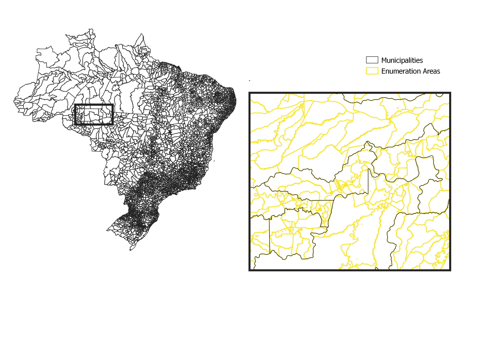
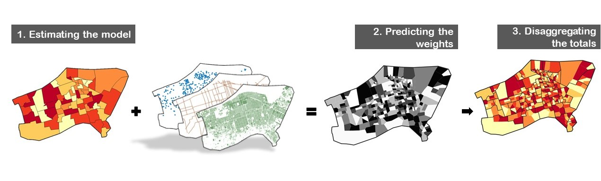
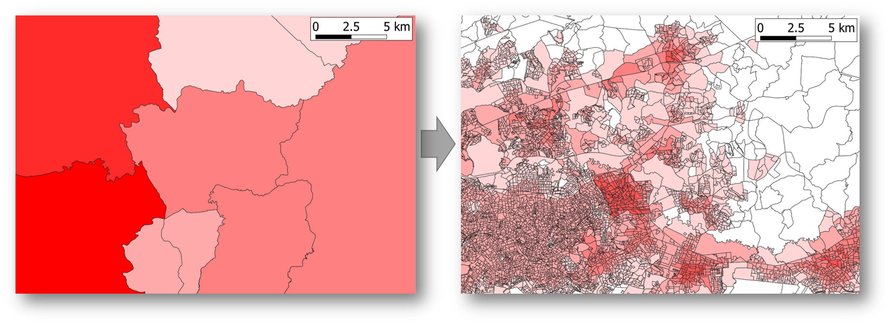

# Introduction

The purpose of top-down disaggregation is to estimate population counts
at a finer spatial resolution than the available population totals for
administrative units. [WorldPop top-down
disaggregation](https://www.worldpop.org/methods/top_down_constrained_vs_unconstrained)
implements a dasymetric mapping approach that uses the random forest
machine learning algorithm to disaggregate projected census totals to
estimate population counts for 100 m grid cells [@stevens2015;
@sorichetta2015]. Dasymetric mapping estimates population counts at a
finer resolution than the input population totals based on relationships
with high resolution geospatial covariates like building locations and
road networks.

In this tutorial, we will demonstrate how to implement this method in
the R statistical programming environment. We will adapt the method to
estimate population counts for census enumeration areas (EAs) rather
than 100 m grid cells. To demonstrate the approach, we will
dissaggregate population totals from municipalities in Brazil to
estimate populations in finer-scale census EAs (Fig. \@ref(fig:boundaries)).

```{r boundaries, echo=F, eval=T, warning=T, fig.cap='Example of enumeration area boundaries in Brazil', out.width = "70%", fig.align="center"}



```

## Pre-requisites

The following software may be needed to complete this tutorial:

1.  [R environment](https://www.r-project.org/),  
2.  [RStudio](https://rstudio.com/) (optional), and
3.  [ArcGIS](https://www.esri.com/) or [QGIS](https://www.qgis.org/)
    (optional to view results).

The following pre-requisite skills may be helpful:

1.  R programming language

    -   install packages, load and manipulate data

2.  Machine learning concepts

    -   predictor and response variables, model diagnostics

3.  GIS concepts

    -   raster and vector data, zonal statistics

# Background

The modelling process consists of three steps (Fig. \@ref(fig:schema)):

1.  Estimate the relationship between population density and geospatial
    covariates at the municipality level,
2.  Predict population densities at the level of enumeration areas using
    the covariates, and
3.  Use predicted densities as a weighting layer to disaggregate the
    population totals for municipalities.

The core product is the weighting layer that should reflect the spatial
distribution of the population inside the municipalities. The final goal
is to predict the population count in each enumeration area correctly.

The extent of the study area is defined by the spatial coverage of the
municipalities for which we have population totals. The top-down method
cannot estimate populations for enumeration areas within municipalities
where population totals are unknown.

```{r schema, echo=F, eval=T, warning=T, fig.cap='Modelling Process', out.width = "100%", fig.align="center"}

```

Random forest is a machine learning algorithm that builds an ensemble of
individual regression trees to predict values of a response variable
(e.g. population density) based on its relationships with geospatial
covariates [@breiman2001; @stevens2015]. Each regression tree
identifies threshold values of the covariates that can be used to split
the training data into fairly homogeneous groups (i.e. with similar
population densities).

The algorithm prevents overfitting by withholding a subset of the
training data for each individual tree that can be used to calculate
rates of "out-of-bag" prediction error (i.e. out-of-sample
cross-validation). The algorithm also prevents overfitting by randomly
selecting a small set of covariates to be considered for splitting the
training data at each node of the regression tree, rather than assessing
all covariates at each split. These features make random forest fairly
robust to multi-collinearity among covariates allowing it to use large
sets of covariates without *a priori* variable selection. However, a
large number of covariates might impact running time, especially at the
prediction stage, and it may be useful to select a subset of covariates
based on the measures of covariate importance provided by the random
forest algorithm [@stevens2015; @bondarenko2018]. While random forest
predictions are robust to multi-collinearity among covariates, the
measures of covariate importance may not be [@genuer2010].

To dive deeper on the subject of random forest, here are some online
materials:

-   A use-R 2009 conference
    [presentation](https://www.r-project.org/conferences/useR-2009/slides/Cutler.pdf)
    given by Adele Cutler who developed the random forest algorithm with
    Leo Breiman.

-   A 2019 [blog
    post](https://towardsdatascience.com/understanding-random-forest-58381e0602d2)
    by Tony Yiu with clear explanations of Random Forest main features
    namely *bagging* and *covariates randomness* that supports the
    creation of uncorrelated forest of decision trees.

-   A 2001
    [article](https://www.stat.berkeley.edu/~breiman/randomforest2001.pdf)
    from Breiman explaining the underlying maths.

The implementation we will provide in this tutorial will follow the
guidance set up by Bondarenko et al. [-@bondarenko2018] to apply random
forest for top-down disaggregation.

# R Environment

This model will be implemented in the R programming language [@r2020r].
Our first step is to setup the R environment so that it contains the R
packages and data that we will need. The `randomForest` package
[@law2018] implements the random forest algorithm in R. If you have not
already installed it, then you will need to install it.

```{r, eval=F}
install.packages('randomForest')
```

Once installed, you must load the `randomForest` package into your R
environment.

```{r, eval=T, message=F, warning=F}
library(randomForest)
```

We will define our working directory to be the location where we have
stored the input data for the tutorial (`master_train.csv` and
`master_predict.csv` described below).

```{r, eval=F}
setwd('c:/myfolder')
```

## Source Data

```{r, eval=T, echo=F, results=F}
master_train <- read.csv("dat/top-down-tutorial/master_train.csv")
master_predict <- read.csv("dat/top-down-tutorial/master_predict.csv")
```

This tutorial includes two input data sets, provided as csv spreadsheets
(comma-separate-values text files):

1.  **master_train.csv** Training data for the model that contains
    population totals and covariate values for `r nrow(master_train)`
    municipalities in Brazil, and

2.  **master_predict.csv** Prediction data for the model that contains
    covariate values for `r nrow(master_predict)` enumeration areas
    where population estimates are needed.

We will load the datasets into our R environment using the `read.csv`
function and display their top five rows with the `head` function:

```{r, eval=F}

# training data from municipalities
master_train <- read.csv("master_train.csv")
# covariates from enumeration areas
master_predict <- read.csv("master_predict.csv")

```

```{r, eval=T}
head(master_train[,1:5]) # only showing first five columns

head(master_predict[,1:4]) # only showing first four columns
```

Notice that only the municipality-level dataset `master_train.csv`
contains a column for population. The EA-level dataset does not contain
a column for population, and it is the goal of this tutorial to estimate
those EA-level populations based on the EA-level covariates in
`master_predict.csv`.

Also, notice that the column names for the covariates are exactly the
same in the municipality-level dataset and the EA-level dataset. All of
the municipality-level covariates used to train the model must also be
available at the EA level for the model predictions.

The `geo_code` column contains a numeric identifier for each
municipality and will be used in later steps to identify the
municipality that each EA belongs to. Boundaries of enumeration areas in
Brazil roughly follow municipality boundaries (i.e. enumeration areas
are nested within municipalities), but the boundaries are not harmonized
exactly. We assigned each enumeration area to the municipality that
contained the majority of its area.

**Note:** We derived the two spreadsheets (`master_train.csv` and
`master_predict.csv`) from the following sources:

1.  Brazil's [municipality
    boundaries](https://www.ibge.gov.br/en/geosciences/territorial-organization/regional-division/23708-brazilian-territorial-division.html?=&t=o-que-e)
    [@ibge2019brazilian],

2.  Brazil's [2020 census
    projections](https://www.ibge.gov.br/en/statistics/social/18448-population-estimates.html?=&t=resultados)
    for municipalities [@ibge2020population],

3.  Brazil's [census EA
    boundaries](http://geoftp.ibge.gov.br/organizacao_do_territorio/malhas_territoriais/malhas_de_setores_censitarios__divisoes_intramunicipais/2019/Malha_de_setores_(shp)_Brasil/)
    [@ibge2020meshes],

4.  WorldPop's
    [mastergrid](ftp://ftp.worldpop.org/GIS/Mastergrid/Global_2000_2020/BRA/L0/)
    for Brazil [@worldpop2018mastergrid], and

5.  WorldPop's [geospatial covariate
    rasters](ftp://ftp.worldpop.org/GIS/Covariates/Global_2000_2020/BRA/)
    for Brazil [@lloyd2019global; @lloyd2017high].

See the section [Zonal Statistics] for more information about how the
input data were created.

# Random Forest

We will reformat the source data into the correct format for the random
forest model before we fit the model and apply it to estimate
populations in each enumeration area (EA). We will start by preparing
the response and predictor variables from `master_train.csv` for
training the model.

## Response Variable

The response variable `y_data` for our random forest model must be a
vector with a population value for each municipality. We will define our
response variable as the log of population density:

```{r, eval=T}
y_data <- master_train$pop / master_train$area

y_data <- log(y_data)
```

We use log population density as the response variable rather than
population counts for two main reasons. First, population densities are
more comparable than counts among spatial units of varying sizes (e.g.
municipalities and EAs). Second, the logarithm transformation reshapes
the response variable as a Gaussian distribution, better inline with the
distributions of covariates [@stevens2015] (Fig. \@ref(fig:hist)). Note
that `master_train$area` is measured in square meters in this case but
any unit of area will work.

```{r hist, echo=F, eval=T, out.align="center", out.width="75%", fig.cap="Histogram of the log-transformed population density."}
hist(y_data, main=NA, xlab="log(population_density)")
```

We now have `y_data`, a vector with the log population density for every
municipality in Brazil.

## Predictor Variables

The predictor data `x_data` for our random forest model must be a
data.frame with a row for each municipality and a column for each
covariate. The row order must match that of `y_data` (i.e. row 1 from
`x_data` must represent the same enumeration area as element 1 from
`y_data`).

We build the predictor data `x_data` by subsetting the covariates from
`master_train.csv` that we would like to include in our model. Remember,
we want to select covariates that will be good predictors of log
population density.

```{r, eval=T}
# list all covariate names (i.e. column names)
cols <- colnames(master_train)
print(cols)
```

Our example data `master_train.csv` includes a few columns that are not
covariates (e.g. `geo_code`) and so we do not want to include them in
`x_data`. Our covariates all include the word "mean" in their column
names because they were calculated as the mean value of underlying
covariate rasters within each municipality. So, we will use "mean" as a
search term to identify the correct columns. This provides an example of
selecting a subset of the predictors, but you could use other subsets,
search terms, or methods of subsetting.

```{r, eval=T}
# select column names that contain the word 'mean'
cov_names <- cols[grepl('mean', cols)] 
print(cov_names)

# subset the data.frame to only these columns
x_data <- master_train[,cov_names]
head(x_data[,1:2]) # only showing first two columns
```

We now have a data.frame `x_data` with a row for each municipality and a
column for each covariate.

## Model Fitting

The model fitting process will identify relationships between the
response variable (i.e. population) and predictor variables at the
municipality level.

### Settings

Before running the random forest model, we need to identify appropriate
values for each argument of the `randomForest()` and/or `tuneRF()`
functions. See `?randomForest` and `?tuneRF` for detailed descriptions
of all arguments to the functions.

A critical argument in `randomForest()` function is `mtry`, the number
of randomly selected variables for evaluating the best split at each
node in a regression tree within the random forest model. This process
is at the root of the randomness in *random* forest models. To find the
optimal `mtry` value, we use the function `tuneRF()` that compares
different models based on their "out-of-bag" error rates.

**Note:** Out-of-bag error is a form of cross-validation that is
calculated by comparing model predictions to observed data from EAs that
were randomly selected to be witheld from model fitting (i.e. held
"out-of-bag") for an iteration of the model (i.e. a single regression
tree in the random forest model).

During each iteration of a random forest model, a regression tree is fit
to a random sub-sample of the data. This prevents overfitting and also
provides a built-in mechanism for cross-validation. The `sampsize`
argument sets the sample size, and the `replace` argument defines the
sampling strategy. In our case, we will define `sampsize` as the total
count of observations (i.e. `r nrow(master_train)` municipalities) and
`replace` will be `TRUE` to sample *with replacement* from the training
data.

Our specifications for other parameters follow Bondarenko et al.
[-@bondarenko2018].

-   **ntree**: Number of trees to grow. There is no issue of overfitting
    when adding additional trees. We opt for 500, the default value of
    the `randomForest()` function.

-   **importance**: If `TRUE`, the model will calculate the covariate
    importance for further analysis. We opt for `TRUE`.

-   **nodesize**: Minimum size of the terminal node of the trees
    controls the tree complexity. We make it about 0.1% of the training
    data sample size (i.e. 5).

### Run the Model

Once we have decided on appropriate settings, we will input them as
arguments to the `tuneRF()` function (note: this may take several
minutes to run).

```{r, eval=F}
# model fitting
popfit <- tuneRF(x=x_data, 
                 y=y_data, 
                 plot=TRUE, 
                 mtryStart=length(x_data)/3, 
                 ntreeTry=500, 
                 improve=0.0001, # threshold on the OOB error to continue the search
                 stepFactor=1.20, # incremental improvement of mtry
                 trace=TRUE, 
                 doBest=TRUE, # last model trained with the best mtry
                 nodesize=length(y_data)/1000, 
                 na.action=na.omit, 
                 importance=TRUE, # calculate variable importance
                 sampsize=length(y_data), # size of the sample to draw for OOB
                 replace=TRUE) # sample with replacement
```

```{r, eval=T, echo=F, results=F}
load('dat/top-down-tutorial/popfit.Rdata')
```

The `popfit` object contains the fitted random forest model. We can see
the items within the object:

```{r, eval=T}
names(popfit)
```

We can retrieve individual values, such as the value of the `mtry`
setting that was selected by the `tuneRF` function.

```{r, eval=T}
popfit$mtry
```

See the "Value" section in the help for the randomForest function
`?randomForest::randomForest` for an explanation of each value.

We will now save the `popfit` object to our hard drive.

```{r, eval=F}
save(popfit, file='popfit.Rdata')
```

We can load the fitted model back into our R environment later using:

```{r, eval=F}
load('popfit.Rdata')
```

## Weighting Layer

We will use the fitted model to create a weighting layer that will be
used to redistribute the population totals for municipalities into the
enumeration areas (EA) within them. The EA-level covariate data
`master_predict.csv` contains `r nrow(master_predict)` rows, one for
each EA in Brazil.

We will first use the fitted random forest model to generate raw model
predictions for each EA and save them as a column in the
`master_predict` data.frame:

```{r, eval=T}
# random forest predictions
master_predict$predicted <- predict(popfit, 
                                    newdata = master_predict)

```

The weights are then calculated from the model predictions using the
following formula:

\begin{equation} 
weight_{i} = \frac{exp(predicted_{i})}{\sum_{i=1}^{I_j}{exp(predicted_{i})}}
(\#eq:weights) 
\end{equation}

where $predicted_i$ is the model prediction for enumeration area $i$,
and $I_j$ is the total number of enumeration areas in municipality $j$.
These weights represent the proportion of the population from
municipality $j$ that lives in enumeration area $i$.

## Redistribution to EA-level

We will now use the weights to estimate the population for each
enumeration area $i$ using the following formula:

\begin{equation} 
population_{i} = total_j \times weight_{i}
(\#eq:prediction) 
\end{equation}

where $total_j$ is the population total for municipality $j$ and
$weight_i$ is the proportion of the population that lives in enumeration
area $i$ (Eq. \@ref(eq:weights)). We will now work through this formula
step-by-step in R.

First, we will exponentiate the predictions (numerator from Eq.
\@ref(eq:weights)) and save them as a column in `master_predict`:

```{r, eval=T}
# back-transform predictions to natural scale
master_predict$predicted_exp <- exp(master_predict$predicted)
```

We need to exponentiate the predictions because we log-transformed the
population densities that we used as the response variable for training
the model. Therefore, the model predictions are population densities on
the log-scale. We exponentiate them to derive the predicted population
densities that we will use as weighting factors to disaggregate the
municipality-level population totals.

Next, we will sum the predicted population densities among EAs in each
municipality (denominator from Eq. \@ref(eq:weights)) and merge the
results into `master_predict` using the `geo_code` column to match
municipalities:

```{r, eval=T}
# sum exponentiated predictions among EAs in each municipality
predicted_exp_sum <- aggregate(list(predicted_exp_sum=master_predict$predicted_exp), 
                               by = list(geo_code=master_predict$geo_code), 
                               FUN = sum)

# merge predicted_exp_sum into master_train based on geo_code
master_predict <- merge(master_predict, 
                        predicted_exp_sum, 
                        by='geo_code')

```

These sums (i.e. the denominator from Eq. \@ref(eq:weights)) are used to
scale the exponentiated model predictions to sum to one among EAs in
each municipality.

Then, we will merge the total populations for each municipality into
`master_predict`, again using the `geo_code` column to match EAs to the
correct municipalities:

```{r, eval=T}
# merge municipality total populations from master_train into master_predict
master_predict <- merge(master_predict,
                        master_train[,c('geo_code','pop')],
                        by = 'geo_code')

# modify column name
names(master_predict)[ncol(master_predict)] <- 'pop_municipality'
```

We have now added all of the required information from Eqs.
\@ref(eq:prediction) and \@ref(eq:weights) into the `master_predict`
data.frame. We will calculate the EA-level population estimates and add
them to `master_predict` as a column:

```{r, eval=T}
# calculate EA-level population estimates
master_predict$predicted_pop <- with(master_predict, predicted_exp / predicted_exp_sum * pop_municipality)
```

Notice that this line of code is equivalent to Eqs. \@ref(eq:prediction)
and \@ref(eq:weights).

We have now disaggregated the population totals from
`r nrow(master_train)` municipalities in Brazil into population
estimates for `r nrow(master_predict)` enumeration areas (Fig.
\@ref(fig:in-out)).

```{r in-out, echo=F, eval=T, warning=T, fig.cap='Census-based population totals for municipalities (left) that have been disaggregated into population estimates for enumeration areas (right) east of Sao Paulo, Brazil. Darker red corresponds to more people.', out.width = "100%", fig.align="center"}



```

## Diagnostics

### Summing Enumeration Areas

We first want to check that the EA-level population estimates sum to the
municipality-level population totals. To do this, we will aggregate the
EA-level predictions using the `geo_code` column to identify the
municipalities that each EA belongs to:

```{r, eval=T}
# sum EA population estimates within each municipality
test <- aggregate(master_predict$predicted_pop, 
                  by = list(geo_code=master_predict$geo_code), 
                  FUN = sum)

# modify column names
names(test) <- c('geo_code','predicted_pop')

# merge municipality population totals
test <- merge(test,
              master_train[,c('geo_code','pop')],
              by = 'geo_code')

# test if estimates match muncipality population totals
all(test$pop == round(test$predicted_pop))
```

If we fail this test (i.e. if the last line of code returns a value of
FALSE), it could mean that there was an error in our implementation of
Eq. \@ref(eq:prediction) or Eq. \@ref(eq:weights) because those
equations should re-scale the EA-level population estimates so that they
always sum to the population totals for each municipality. This test
does not assess the goodness-of-fit for the random forest model.

### Goodness-of-Fit

The `print` function from the randomForest package displays two metrics
that describe the out-of-bag prediction residuals:

-   the mean squared residuals (MSE)

-   the % of variance explained which corresponds to a pseudo $R^2$,
    (1 - MSE/ Var(`y_data`)).

The first metric (MSE) is dependent on the scale of the input response
variable (e.g. the unit of area used to calculate population density),
whereas the second metric ($R^2$) can be compared across models with
different response variables.

```{r, eval=T}
# goodness-of-fit metrics
print(popfit) 
```

We can visualize the out-of-bag predictions for municipalities.

First we plot the observed vs predicted values. This enables us to spot
any municipalities where the random forest predictions are not accurate.

```{r obs-pred, eval=T}
# plot observed vs predicted (out-of-bag)
plot(x = y_data,
     y = predict(popfit), 
     main = 'Observed vs Predicted log-Densities')

# 1:1 line
abline(a=0, b=1, col='red')
```

**Note:** The predict function in this code will return "out-of-bag"
predictions (i.e. weights) for every municipality because we did not
give it a new prediction data set, like we did in the section [Weighting
Layer] (see`?predict.randomForest` for more info). The "out-of-bag"
prediction for a municipality is generated from the regression trees of
the model that did not include that municipality in their randomly
sampled training data. This provides a cross-validation (a.k.a.
out-of-bag, or out-of-sample) assessment.

Plotting the residuals versus the predictions allows us to detect any
pattern towards over or underestimation.

```{r resid, eval=T}
# plot residuals (out-of-bag)
plot(x = predict(popfit), 
     y = y_data - predict(popfit), 
     main = 'Residuals vs Predicted',
     ylab = 'Out-of-bag residuals',
     xlab = 'Out-of-bag prediction')

# horizontal line at zero
abline(h=0, col='red')
```

**Important Note:** The different goodness-of-fit diagnostics presented
here are focused on the training dataset and thus on predicting at the
municipality level, but remember that the final goal is to predict at
the enumeration area level.

### EA-level Assessment

There are two ways to evaluate the disaggregation results at the
EA-level:

1.  Comparing to an independent sample of enumeration areas or any other
    fine-scale spatial units for which we know the population counts, or
2.  Build a test model using aggregated population counts at a coarser
    resolution (e.g. state-level) and evaluating its predictions at the
    municipality level.

The first option relies on the availability of an additional dataset.
Disaggregating population estimates into 100 m grids rather than
enumeration area polygons (as in this tutorial) would provide greater
flexibility for aggregating units to match the spatial units of the
independent validation data.

The second option is discussed by Stevens et al. [-@stevens2015]. Its
effectiveness depends on the size of the aggregated training dataset
(e.g. the number of states). Indeed a coarser scale means a decreasing
number of input observations, which undermines the quantity of
information the random forest can extract.

### Covariate Importance

We can look at the influence of individual covariates on model
predictions. There are two measures of variable importance available.
"Type 1" covariate importance is computed as the difference between
out-of-bag mean squared error (MSE) from the full model compared to a
model in which the variable is randomly permuted for each tree. If MSE
is not affected by random permutations of the variable, then it has low
importance according to this metric.

```{r, eval=T}
# for covariate importance
varImpPlot(popfit, type=1) 
```

"Type 2" covariate importance is computed as the total decrease in node
purity when the variable is used for a split in the regression trees.
Node purity is defined as the residual sum of squares among samples that
are classified into the same terminal node of a regression tree. If
splits in the tree based on this covariate do not decrease the residual
sum of squares, then it has low importance according to this metric.

```{r, eval=T}
# for covariate importance
varImpPlot(popfit, type=2) 
```

See `?randomForest::importance` for more details.

**Note:** Use caution when interpreting covariate importance. A high
importance value indicates that the covariate improves predictive
performance, but does not indicate a causal relationship with spatial
patterns of population density. Covariate importance scores may also be
underestimated for large groups of correlated predictor variables.

# Limitations

1.  **Random Forest can be time-intensive for large datasets.**

    If running time becomes an issue, there are several solutions that
    are outlined in the random forest set-up of Bondarenko et al.
    [-@bondarenko2018].

    If the model takes too long to be fitted, one can play with the
    parameter `sampsize`, which has a great impact on modelling time or
    `ntreeSize`. Be careful though as a small number of trees can lead
    to overfitting. This issue can be clearly visible in any out-of-bag
    goodness-of-fit metrics.

    If the prediction takes too much time, Stevens et al.
    [-@stevens2015] proposes to prune the number of covariates based on
    their importance metric. We have also provided an example of how to
    generate predictions more efficiently using parallel processing (see
    [Parallel Processing] section below).

2.  **Random Forest models are not good at extrapolating.**

    They can only predict values that are in the range of observed
    values. This issue becomes a problem when the training and
    prediction inputs differ in range and distribution, which is known
    as *covariate shift*. The following plot can help detect a mismatch
    in covariates distribution between the two scales.

    ```{r cov-scale, out.width="100%", out.align="center", eval=T, fig.cap="The distributions of two covariates at each spatial scale: municipalities and enumeration areas. The left panel shows similar distributions across scales, but the right panel shows a covariate with significantly different distributions when measured for municipalities compared to enumeration areas."}

    # two panel layout
    layout(matrix(1:2, nrow=1))

    # loop through two covariates
    for(cov_name in c('mean.bra_srtm_slope_100m', 'mean.bra_viirs_100m_2016')){
      
      # combine EA-level and municipality-level values into a single vector
      y <- c(master_predict[,cov_name], master_train[,cov_name])
      
      # create corresponding vector identifying spatial scale
      x <- c(rep('EA', nrow(master_predict)),
         rep('Municipality', nrow(master_train)))
      
      # create boxplot
      boxplot(y~x, xlab=NA, ylab=cov_name)
    }
    ```

    Notice that the covariate `mean.bra_viirs_100m_2016` has a different
    range of values for EAs compared to municipalities (Fig.
    \@ref(fig:cov-scale)). This covariate measures the intensity of
    nighttime lights and we would expect its average values to be less
    in larger municipalities with large unsettled sections compared to
    small EAs, many of which are densely populated. This covariate was
    also the most influential on model predictions (see [Covariate
    Importance]). We may want to consider re-calculating this covariate
    using a mask to exclude unsettled areas within municipalities and
    EAs in an attempt to have a more comparable measure between spatial
    scales.

3.  **Random Forest models are not ideal for inferring covariate
    effects.**

    The purpose of the modelling is to have a great predictive
    performance. We are not aiming at explaining the drivers of human
    spatial distribution. Therefore no causal effect should be derived
    from the modelling results.

# Tips and Tricks

The previous sections demonstrated the basic components of random forest
top-down disaggregation, but there are additional tips and tricks that
may be useful.

This section utilizes several source files that we did not include with
the tutorial because they are large files that are publicly available
from their original sources. These source files are:

1.  [Enumeration area
    boundaries](http://geoftp.ibge.gov.br/organizacao_do_territorio/malhas_territoriais/malhas_de_setores_censitarios__divisoes_intramunicipais/2019/Malha_de_setores_(shp)_Brasil/)
    for Brazil [@ibge2020meshes],

2.  [VIIRS nighttime
    lights](ftp://ftp.worldpop.org/GIS/Covariates/Global_2000_2020/BRA/VIIRS/)
    from 2016 [@worldpop2018geospatial], and

3.  [WorldPop
    mastergrid](ftp://ftp.worldpop.org/GIS/Mastergrid/Global_2000_2020/BRA/L0/)
    for Brazil [@worldpop2018mastergrid].

**Note:** The code below will assume that these source files have been
downloaded and unzipped (if applicable) into your working directory.

## Map Results

If you want to view the EA-level population estimates on a map (e.g.
Fig. \@ref(fig:in-out)), you will need to join the model results (from
section [Redistribution to EA-level] above) to polygon features for use
with GIS software (e.g. Esri polygon shapefile).

For this step, we will need to install and load the `sf` package
[@pebesma2018simple] to read and manipulate GIS vector data (census
EAs, in this case).

```{r, eval=F}
install.packages('sf')
library('sf')
```

Then, we need to load a vector GIS data set containing the polygons that
we would like to join our model results to. For this example, we are
using Brazilian census enumeration area polygons which are openly
available online as a polygon shapefile [@ibge2020meshes].

```{r, eval=F}
sf_polygons <- st_read('BR_Setores_2019.shp')
```

**Note:** The `st_read` function can read most GIS file formats (e.g.
Esri shapefile, geopackage, geojson). See `?sf::st_read` for more
information.

We will add an ID column that matches the enumeration area IDs from the
`EA_id` column of the `master_predict` data.frame object (continuing
from previous sections of this tutorial).

```{r, eval=F}
sf_polygons$EA_id <- 1:nrow(sf_polygons)
```

Then, we can merge the `master_predict` data.frame which contains our
EA-level population estimates into `sf_polygons`. We will use the
`EA_id` column to match values to the correct enumeration area polygons.

```{r, eval=F}
sf_polygons <- merge(sf_polygons, 
                     master_predict,
                     by='EA_id')
```

Finally, we save the results to disk as an Esri shapefile.

```{r, eval=F}
st_write(sf_polygons,
         'master_predict_polygons.shp')
```

This will save the result as an Esri shapefile because it uses the
`.shp` file extension. If we want to save to a different format, we can
simply modify the file extension. For example, we can save the result as
a GeoPackage by adding the`.gpkg` file extension.

```{r, eval=F}
st_write(sf_polygons,
         'master_predict_polygons.gpkg')
```

## Zonal Statistics

This tutorial began with two pre-processed spreadsheets
`master_train.csv` and `master_predict.csv`. These input data were
derived from raster-based covariates using zonal statistics to summarize
raster values within each municipality and enumeration area using mean
values or other summary statistics (e.g. median, mode, standard
deviation, min, max). We will give a brief demonstration of how to do
this.

We will rely on the `raster` and `exactextractr` packages
[@hijmans2020raster; @bastan2020exactextractr] for this step and so we
will first install and load those packages:

```{r, eval=F}
install.packages(c('raster','exactextractr'))
library('raster')
library('exactextractr')
```

We already have polygon features `sf_polygons` loaded from the previous
section ([Map Results]). We will also need to load a covariate raster.
We will use a nighttime lights raster for Brazil that is openly
available [@worldpop2018geospatial].

```{r, eval=F}
raster_covariate <- raster('bra_viirs_100m_2016.tif')
```

Next, we will calculate a zonal mean within each enumeration area using
the object `sf_polygons` (from section [Map Results]).

```{r, eval=F}
sf_polygons$mean.bra_viirs_100m_2016 <- exact_extract(x = raster_covariate,
                                                      y = sf_polygons,
                                                      fun = 'mean')
```

Here, we saved the results into a new column of the `sf_polygons`
data.frame called `mean.bra_viirs_100m_2016`.

**Note:** You may receive a warning message:
`Polygons transformed to raster CRS (EPSG:NA)`. This indicates that the
projection for `sf_polygons` was different than `raster_covariate`, and
that a reprojection was performed internally by `exact_extract`. This
does not affect our results, but we could have avoided the warning
message by first reprojecting the covariate raster to match the polygons
(see `?raster::projectRaster`) or by reprojecting the polygons to match
the covariate raster (see `?sf::st_transform`).

After we have calculated all of the zonal statistics that we need, we
can save the `sf_polygons` data.frame to disk as a csv spreadsheet.

```{r, eval=F}
write.csv(st_drop_geometry(sf_polygons), 
          file = 'EA_covariates.csv',
          row.names = FALSE)
```

This would be comparable to `master_predict.csv` that we used as input
data for this tutorial. Note that the `st_drop_geometry()` function
removes the polygon geometries from the `sf` object so that it is a
simple data.frame with no spatial geometries (i.e. polygons) associated
with each row. We could also save the results as an Esri shapefile to
maintain the feature geometries.

```{r, eval=F}
st_write(sf_polygons, 'EA_covariates.shp')
```

**Note:** The [exactextractr
README](https://cran.r-project.org/web/packages/exactextractr/readme/README.html)
also demonstrates a simple workflow to calculate zonal statistics for
Brazilian municipalities.

## Gridded Population Estimates

In this tutorial, we disaggregated municipality-level population totals
into finer resolution EA-level population estimates. We can also
disaggregate population totals into grid cells (e.g. 100 m, 1 km). It is
often easier to work with gridded population estimates because they can
be aggregated to any areal units (e.g. census enumeration areas,
administrative units, health facility catchment areas) and they may also
be easier to compare to gridded data from other sources.

To do this, we need to create a new version of `master_predict.csv`
where each row represents a grid cell rather than an enumeration area.
We will start by loading a raster to use as a mastergrid that defines
the locations and sizes of grid cells that we want to use.

```{r, eval=F}
mastergrid <- raster('bra_level0_100m_2000_2020.tif')
```

This mastergrid raster for Brazil is publicly available from WorldPop
[-@worldpop2018mastergrid]. In this mastergrid, any cells that contain
a value of NA are outside of Brazil.

Cell IDs for a raster are a numerical sequence starting from 1 in the
top-left corner of the raster and increasing left-to-right. There are
more than 2.5 billion grid cells in Brazil's mastergrid and more than
one billion contain non-NA values. We want to identify the cell IDs for
all cells with a non-NA value. Because Brazil contains so many grid
cells, we will subset the mastergrid for processing.

```{r, eval=F}
cells <- which(!is.na(mastergrid[1:1e7]))
```

The new vector object `cells` will contain the cell IDs from the
mastergrid that contain non-NA values. We are only processing the first
10 million grid cells (i.e. cells 1 to 1e7) in the mastergrid. We will
continue the example using only this subset of the data to demonstrate
how to generate gridded population estimates. In practice, we may want
to process all of the grid cells at once (if computing power allows) or
loop through one subset of cell IDs at a time (e.g. using a for loop)
until all cell IDs are processed.

We will now setup a data.frame with a column for the cell IDs.

```{r, eval=F}
mastergrid_predict <- data.frame(row.names = cells)
```

Next, we will use the same covariate raster `raster_covariate` from the
previous section ([Zonal Statistics]) [@worldpop2018geospatial]. This
raster has the exact same extent and cell size as the mastergrid.
Because the two rasters have identical extent and cell size, their cell
IDs are comparable allowing us to use our vector of cell IDs `cells` to
extract values very quickly and save them as a new column in the
data.frame `master_predict`.

```{r, eval=F}
mastergrid_predict[cells, 'bra_viirs_100m_2016'] <- raster_covariate[cells]
```

If the extent and cell size of a covariate raster do not match, then we
can extract values from the covariate raster using the point coordinates
associated with each grid cell rather than using cell IDs, but this is a
slower process.

```{r, eval=F}
# XY coordinates of each grid cell
xy <- xyFromCell(mastergrid, cells)

# extract raster values at those coordinates  
mastergrid_predict[cells, 'bra_viirs_100m_2016_alt'] <- extract(raster_covariate, xy)
```

**Note:** Another option would be to resample the covariate raster to
match the mastergrid, but exploring the different options for resampling
is beyond the scope of this tutorial (see `?raster::resample` for more
information).

We can then save the results as a csv spreadsheet.

```{r, eval=F}
write.csv(mastergrid_predict,
          file = 'mastergrid_predict.csv',
          row.names = FALSE)
```

This spreadsheet could be used in exactly the same way as
`master_predict.csv` was used above to generate model predictions (see
section [Weighting Layer]). Because there are so many grid cells in
Brazil where predictions are needed we would likely want to use parallel
processing to speed up the calculations (see [Parallel Processing]
section below). With either approach, we would generate a new column
called `predicted_pop` in the `master_predict` data.frame that would
contain the population estimates for each grid cell.

After we have these model predictions in tabular form in
`master_predict`, we would then want to rasterize those results. First,
we create an empty raster.

```{r, eval=F}
raster_predict <- raster(mastergrid)
```

Then, we insert the population estimates into the raster based on the
cell IDs of the predicted values.

```{r, eval=F}
raster_predict[cells] <- mastergrid_predict[cells, 'predicted_pop']
```

If we are processing the cells in different subsets (i.e. using a for
loop), we can repeat this step on the same raster using different sets
of cell IDs until the raster is fully populated.

Finally, we can save the rasterized results to disk as a geotiff raster.

```{r, eval=F}
writeRaster(raster_predict, 
            file = 'raster_predict.tif')
```

## Parallel Processing

Parallel processing can improve processing speed when the study area
contains a large number of spatial units where predictions are required
(i.e. grid cells or polygons). For parallel processing, we will split
the data into chunks that will be processed simultaneously using all of
the processing cores available in our computer. The process that we
described above to generate model predictions (see section [Weighting
Layer]) used only a single processing core even if your computer had
four or more cores available.

In the example from the previous section ([Gridded Population
Estimates]), we saw that Brazil contained more than one billion grid
cells where we would need model predictions. This would likely require
parallel processing to generate model predictions efficiently. For a
simple and efficient example, we will demonstrate parallel processing
using the EA-level data in `master_predict` that will allow you to
explore the process easily. When you are comfortable with the process,
it can also be applied to the much larger data set in
`mastergrid_predict`.

For this task we will need the `doParallel` R package
[@microsoft2020doParallel] so we will start by installing and loading
that package.

```{r, eval=F}
install.packages('doParallel')
library('doParallel')
```

We will need to create a new R function that will generate model
predictions. In the parallel processing steps that will follow, this
function will be passed to a processing core along with a chunk of the
data to generate predictions.

```{r, eval=F}
predict_pop <- function(df, model=popfit){
  
  # EA-level predictions
  prediction <- predict(model, newdata = df)
  
  # back-transform to population density
  density <- exp(prediction)
  
  # calculate weights
  weights <- density / sum(density) 
  
  # disaggregate municipality total to EA-level
  pop <- weights * df$pop_municipality[1]
  
  # result to data.frame
  result <- data.frame(id=df$id, predicted_pop_parallel=pop)
  
  # return result
  return(result)
}
```

The `df` argument of the function will be a subset of rows from
`master_predict` and the `model` argument is the fitted random forest
object `popfit`. This function generates model predictions using the
`predict` function from the `randomForest` package and then it
back-transforms the predicted log-densities to the natural scale. It
then calculates weights from those densities and multiplies the weights
by the total population for the municipality that each grid cell belongs
to (note: these are the same steps as in section [Redistribution to
EA-level]). The results are returned as a data.frame with an "id" column
and a column containing the predictions.

Now, we will add an "id" column into `master_predict` that we will later
use to merge the predictions back into this data.frame.

```{r, eval=F}
master_predict$id <- 1:nrow(master_predict)
```

Next, we will break the `master_predict` data.frame into chunks that
will be stored as elements in a list object.

```{r, eval=F}
list_master_predict <- split(x = master_predict,
                             f = master_predict$geo_code)
```

Notice that we have used the `geo_code` column in `master_predict` to
define the chunks. Remember, that `geo_code` identifies each
municipality, so we will be processing each municipality separately.
This simplifies the steps that are required in the predict function
(above) because all units processed in a chunk use the same
municipality-level total population (i.e. `df$pop_municipality[1]`). The
new object `list_master_predict` is a list with an element for each
municipality that contains a data.frame with a row for each spatial unit
within that municipality.

Now, we must setup parallel processing by identifying the number of
cores available, assigning them to a processing cluster, and activating
the cluster.

```{r, eval=F}
cores <- detectCores()
  
cluster <- makeCluster(cores)
  
registerDoParallel(cluster)
```

Then, we can run the predictions in parallel using this cluster.

```{r, eval=F}
predicted <- foreach(i = 1:length(list_master_predict), 
                     .combine = 'rbind',
                     .packages = c("randomForest")) %dopar% 
  predict_pop(df = list_master_predict[[i]])

stopCluster(cluster)
```

This code will pass each element `i` from `list_master_predict` to our
predict function `predict_pop()` and then combine the resulting
data.frames using the `rbind()` function. The last line of code simply
deactivates our cluster of processing cores.

The last step is to merge the results back into our original data.frame
`master_predict` using the `id` column that we setup earlier.

```{r, eval=F}
master_predict <- merge(master_predict,
                        predicted,
                        by = 'id')
```

**Note:** We have demonstrated parallel processing using the EA-level
data in `master_predict`. It is important to note that EA-level
predictions do not take too long to compute using the simpler approach
(see section [Weighting Layer]). We recommend parallel processing only
for larger tasks like generating gridded predictions from
`mastergrid_predict`. We did not use this data in our example because it
would potentially introduce complications that would distract from the
demonstration of parallel processing, but the workflow that we
demonstrated should be easily adaptable to accommodate any larger data
sets.

# Contributions {-}

This tutorial was written by Doug Leasure and Edith Darin from the
WorldPop Research Group at the University of Southampton with oversight
from Andy Tatem. This work was part of a WorldPop collaboration with the
Brazilian Institute of Geography and Statistics (IBGE), United Nations
Population Fund (UNFPA), and the Environmental Systems Research
Institute (Esri). Attila Lazar and Chris Jochem provided internal
reviews that helped improve the tutorial.

# Suggested Citation {-}

Leasure DR, Darin E, Tatem AJ. 2020. Small area population estimates
using random forest top-down disaggregation: An R tutorial. WorldPop,
University of Southampton. <doi:10.5258/SOTON/WP00697>.

# License {-}

You are free to redistribute this tutorial under the terms of a
<a href="https://creativecommons.org/licenses/by/4.0/" target="_blank">CC
BY 4.0</a> license.

*WorldPop, University of Southampton, and their sponsors offer these
data on a "where is, as is" basis; do not offer an express or implied
warranty of any kind; do not guarantee the quality, applicability,
accuracy, reliability or completeness of any data provided; and shall
not be liable for incidental, consequential, or special damages arising
out of the use of any data that they offer. If users encounter apparent
errors or misstatements, they should contact WorldPop at
[release\@worldpop.org](mailto:release@worldpop.org).*

# References {-}
